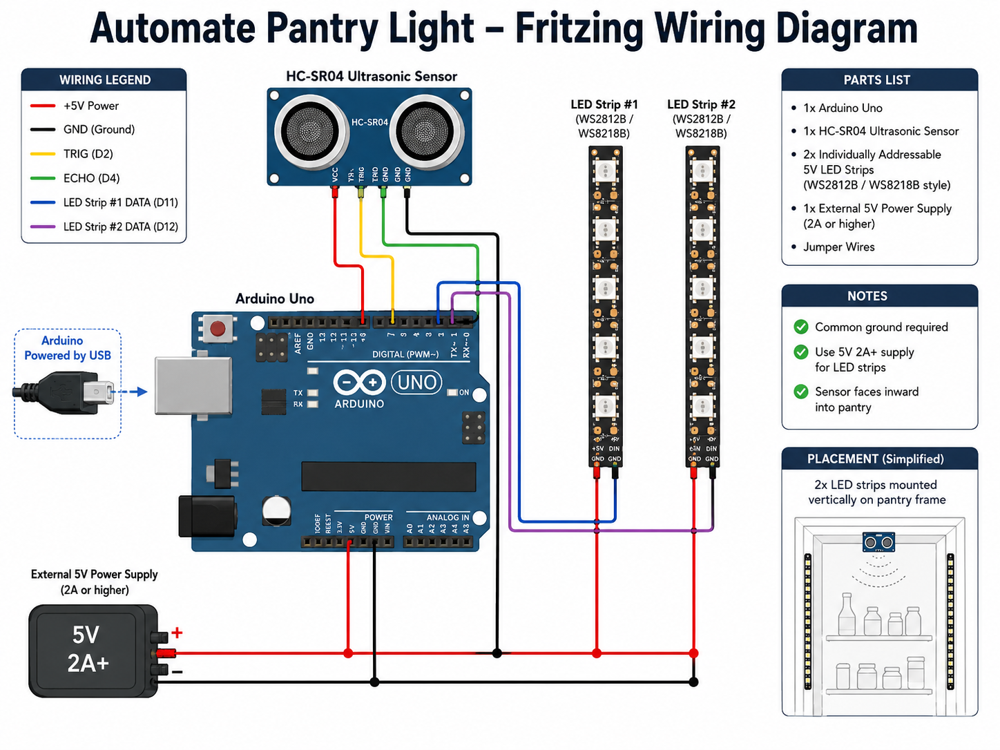
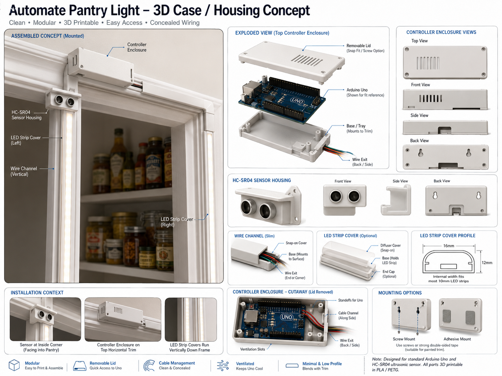

<a name="readme-top"></a>

<!-- PROJECT LOGO -->
<br />
<div align="center">
  <a href="https://github.com/github_username/repo_name">
    
  </a>

**An automatic pantry light that turns on when you open the door and off when you close it.**

[](https://www.arduino.cc/)
[](https://www.adafruit.com/category/168)
[](LICENSE)
</div>
<br />


<!-- TABLE OF CONTENTS -->
<details>
  <summary>Table of Contents</summary>
  <ol>
    <li>
      <a href="#about-the-project">About The Project</a>
    </li>
    <li>
      <a href="#getting-started">Getting Started</a>
      <ul>
        <li><a href="#prerequisites">Parts List</a></li>
        <li><a href="#prerequisites">Built With</a></li>
        <li><a href="#installation">Installation</a></li>
      </ul>
    </li>
    <li><a href="#schematic">Schematic</a></li>
    <li><a href="#housing">3D Printed Housing</a></li>
    <li><a href="#roadmap">Roadmap</a></li>
    <li><a href="#contact">Contact</a></li>
  </ol>
</details>


<!-- ABOUT THE PROJECT -->
## About The Project

Upon moving into my new home, I quickly realized that there was no light in the pantry. Every time I needed something, I found myself fumbling around in the dark, which was both inconvenient and frustrating. As a programmer, I saw this as an opportunity to apply my skills to solve a real-world problem. I leaped into action and designed an automated lighting system specifically for the pantry.

I installed an ultrasonic sensor that detects the distance to the pantry door. When the distance exceeds my set value, the sensor triggers the LED strips to turn on. This way, you never have to fumble for a switch or worry about forgetting to turn the light off when you leave. I also included a timer that ensures the light turns off after a certain period of inactivity, conserving energy and providing peace of mind.

Now, the pantry is always well-lit when needed, making it easier to find items and enhancing the overall functionality of the space. This small yet impactful project not only solved a daily annoyance but also highlighted the practical applications of programming in everyday life.

## Schematic



## Housing

A custom 3D-printed enclosure is being designed to house the Arduino Uno, sensor, and wiring neatly.



Stay tuned — the STL files will be added once finalized.

<!-- GETTING STARTED -->
## Getting Started


### Parts list 

<ul>
  <li>
      ( 1 ) Inland HC-SR04 Blue Ultrasonic Module
  </li>
  <li>
      ( 2 ) Inland WS8218B Individually Addressable LED Strip
  </li>
  <li>
      ( 1 ) Adruino Uno
  </li>
</ul>

<p align="right">(<a href="#readme-top">back to top</a>)</p>

### Built With


### Installation

1. Get the Arduino software at [Arduino.com](https://Arduino.com)
2. Clone the repo
``` 
git clone https://github.com/iamDaleon/Automate_Pantry_Light.git 

```
3. Install the Automated_Pantry_Light onto the Arduino
4. Wire up cables to the correct ports
5. Enjoy the project.


<!-- ROADMAP -->
## Roadmap

- [ Breadboard & test functionality ] Feature 1 - <strong>COMPLETED</strong>
- [ Design and 3D Print a Case ] Feature 2 - <strong>IN PIPELINE</strong> — see the [Housing render](#housing)
- [ Add Photos of the device ] Feature 3 - <strong>TBA</strong>
- [ Redesign and continue the process ] Feature 4 - <strong>TBA</strong>
- [ Add the schematics, Instruction... etc ] Feature 5 - <strong>COMPLETED</strong>

<p align="right">(<a href="#readme-top">back to top</a>)</p>


<!-- CONTACT -->
## Contact

iamDaleon - [@iamDaleon](https://twitter.com/iamDaleon)

Project Link: [Automate Pantry-Light](https://github.com/iamDaleon/Automate_Pantry_Light)

<p align="right">(<a href="#readme-top">back to top</a>)</p>
