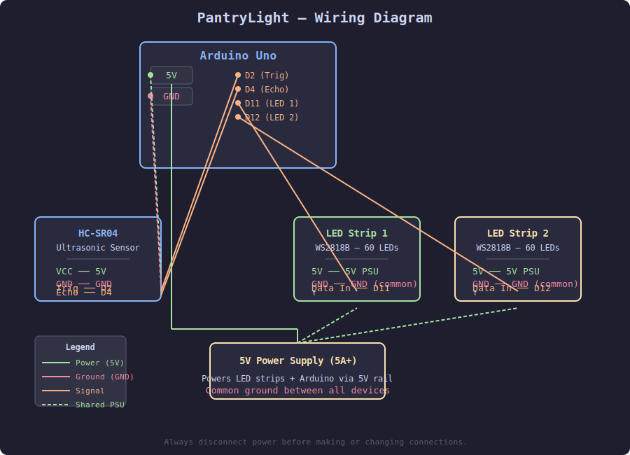

# Wiring

> **⚠️ WARNING:** Always disconnect power before making or changing connections.

## HC-SR04 Ultrasonic Sensor

```
HC-SR04         Arduino Uno
───────         ───────────
VCC     ─────→  5V
GND     ─────→  GND
Trig    ─────→  D2
Echo    ─────→  D4
```

## WS2818B LED Strip (×2)

```
LED Strip 1     Arduino Uno
───────────     ───────────
5V       ─────→  5V (external PSU recommended)
GND      ─────→  GND (common ground with Arduino)
Data In  ─────→  D11

LED Strip 2     Arduino Uno
───────────     ───────────
5V       ─────→  5V (external PSU recommended)
GND      ─────→  GND (common ground with Arduino)
Data In  ─────→  D12
```

> **Note:** If driving 120 LEDs total (2×60), each strip can draw up to ~2A at full brightness (white). A 5V / 5A power supply is recommended. Power the Arduino via USB or its barrel jack, and power the LED strips from the shared 5V PSU with a common ground.

## Wiring Diagram



*Wiring diagram source: [`docs/wiring.svg`](wiring.svg) — open in any browser.*
